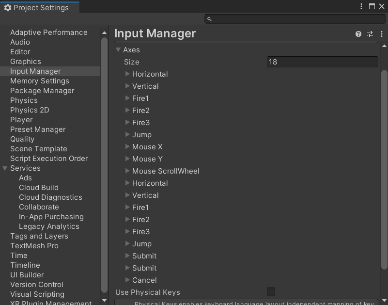

# Input.GetButtonUp

键盘抬起的**那一帧**返回 `true`

## 定义

```csharp
public static bool GetButtonUp(string buttonName);
```

| 参数名        | 类型     | 必要  | 说明                                                                                                                     |
|:---------- |:------ |:--- |:---------------------------------------------------------------------------------------------------------------------- |
| buttonName | string | 是   | 按键对应字符串，如 `"Jump"`、`"Mouse X"`，只能为在 `InputManager` 中定义的轴键，可在 Unity 窗口 `Editor > Project Settings > Input Manager` 中找到。 |




~~~admonish example title="示例"
```csharp
using UnityEngine;

public class ExampleScript : MonoBehaviour
{
    public float fireDelta = 1.0f; // 开火间隔

    private float _myFireDelta;

    private void Start()
    {
        _myFireDelta = fireDelta;
    }

    private void Update()
    {
        _myFireDelta -= Time.deltaTime; // 减少冷却

        if (Input.GetButtonDown("Fire1"))
            Debug.Log("已按下开火");

        // 按下开火并且冷却完成
        if (Input.GetButton("Fire1") && _myFireDelta <= 0)
        {
            Debug.Log("正在开火...");
            _myFireDelta = fireDelta; // 开火后重置冷却时间
        }

        if (Input.GetMouseButtonUp(0))
            Debug.Log("已停止开火");
    }
}
```
~~~